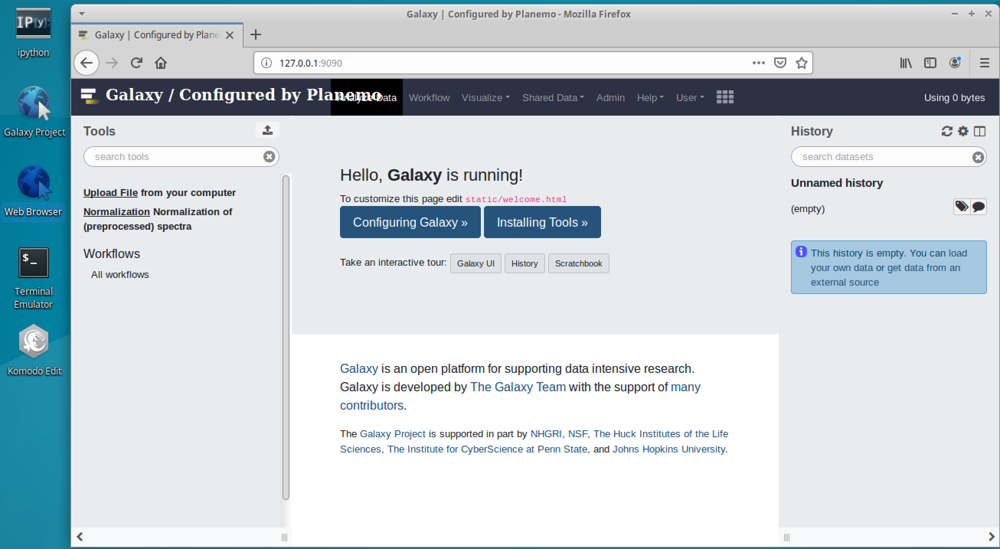
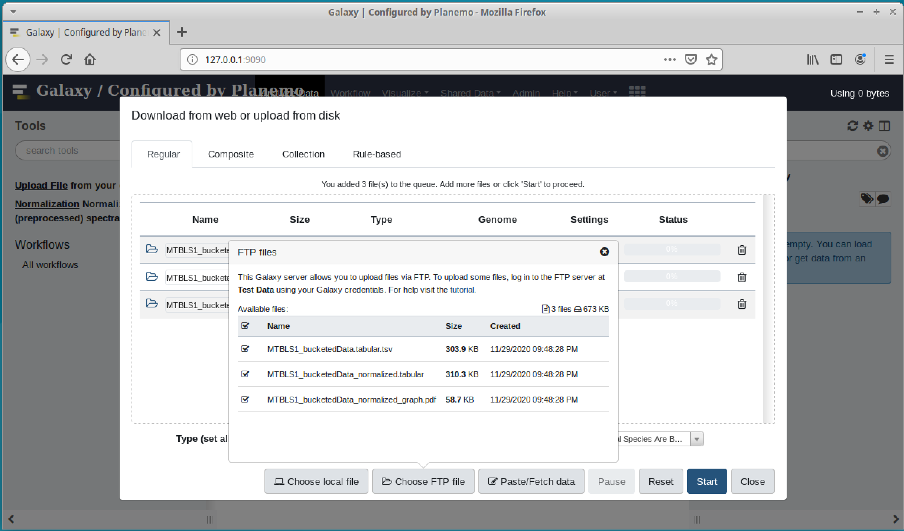
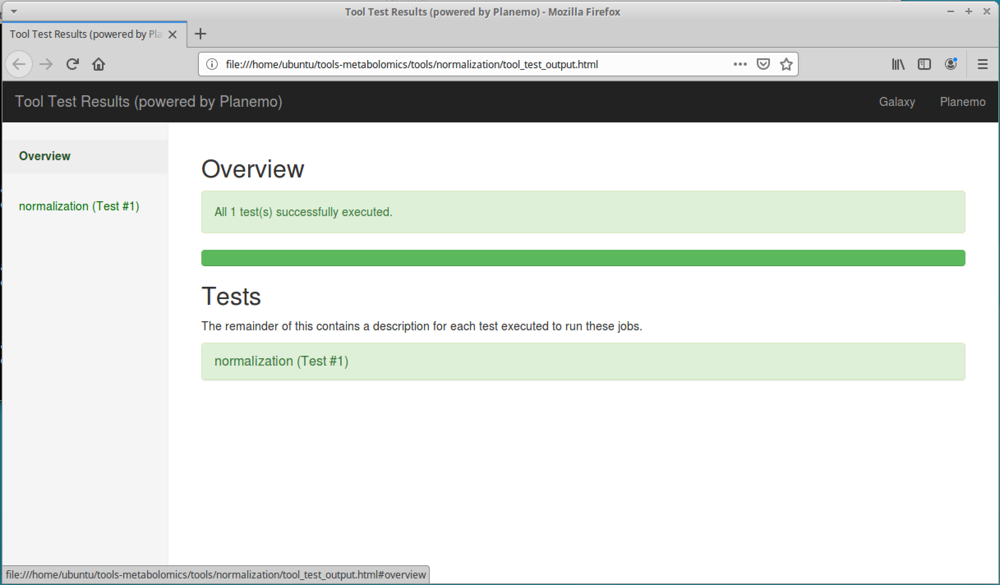

# Guide for Planemo

## `planemo lint`

`planemo lint` checks for common errors and best practices. It will check different criterias to know if the xml wrapper is in good shape.

Let's take an existing tool: "normalization"

```bash
$ cd ~/tools-metabolomicstools/normalization/
$ planemo lint .
Linting tool /private/tmp/tools-metabolomics/tools/normalization/NmrNormalization_xml.xml
Applying linter tests... CHECK
.. CHECK: 1 test(s) found.
Applying linter output... CHECK
.. INFO: 3 outputs found.
Applying linter inputs... CHECK
.. INFO: Found 8 input parameters.
Applying linter help... CHECK
.. CHECK: Tool contains help section.
.. CHECK: Help contains valid reStructuredText.
Applying linter general... CHECK
.. CHECK: Tool defines a version [1.0.7].
.. CHECK: Tool defines a name [Normalization].
.. CHECK: Tool defines an id [normalization].
.. CHECK: Tool targets 16.01 Galaxy profile.
Applying linter command... CHECK
.. INFO: Tool contains a command.
Applying linter citations... CHECK
.. CHECK: Found 1 likely valid citations.
Applying linter tool_xsd... CHECK
.. INFO: File validates against XML schema.
```

All seems good! Otherwise, you may to inverse some tags or complete others.

To complete this checking, you can have a look at the [IUC Best Practices](https://galaxy-iuc-standards.readthedocs.io/en/latest/best_practices/tool_xml.html)

## `planemo serve`
`planemo serve` launches Galaxy instance with specified tools.

### 1. Launch planemo server within the tool directory
```
$ cd tools-metabolomics/tools/normalization/
$ planemo serve
Starting Galaxy with
[...]
Starting server in PID 7800.
serving on http://127.0.0.1:9090
```

### 2. Open a web-browser



### 3. Import your test data in the history
1. Upload file from your computer
2. Choose FTP file
3. Tick the necessary files
4. Start



**Note:** It can take ages! Because Galaxy need to install a dependency to upload files.

You can check that in an other terminal:
```bash
$ ps -edf | grep miniconda
ubuntu    9121  7800 92 22:02 pts/8    00:03:45 /home/ubuntu/miniconda3/bin/python /home/ubuntu/miniconda3/bin/conda create -y --quiet --override-channels --channel iuc --channel conda-forge --channel bioconda --channel defaults _bcftools@1.5 bcftools=1.5
```


### 4. Run the tool


**Note:** It can take ages! Because Galaxy need to the tool dependencies.

You can check that in an other terminal:

```bash
$ ps -edf | grep miniconda
ubuntu    9121  7800 92 22:02 pts/8    00:03:45 /home/ubuntu/miniconda3/bin/python /home/ubuntu/miniconda3/bin/conda create -y --quiet --override-channels --channel iuc --channel conda-forge --channel bioconda --channel defaults --name __r-batch@1.1_4 r-batch=1.1_4
```

You can also check the log in the `planemo serve` terminal:

```
Package plan for installation in environment /home/ubuntu/miniconda3/envs/__r-batch@1.1_4:

The following NEW packages will be INSTALLED:

    _libgcc_mutex:           0.1-conda_forge            conda-forge
    _openmp_mutex:           4.5-1_gnu                  conda-forge
    _r-mutex:                1.0.1-anacondar_1          conda-forge
[...]
    r-base:                  3.5.1-hc461eb7_1012        conda-forge
    r-batch:                 1.1_4-r351_1001            conda-forge
[...]
galaxy.jobs.command_factory INFO 2020-11-29 22:24:37,533 Built script [/tmp/tmp2QjWR8/job_working_directory/000/2/tool_script.sh] for tool command [[ "$(basename "$CONDA_DEFAULT_ENV")" = "$(basename '/home/ubuntu/miniconda3/envs/__r-batch@1.1_4')" ] ||
MAX_TRIES=3
COUNT=0
while [ $COUNT -lt $MAX_TRIES ]; do
    . '/home/ubuntu/miniconda3/bin/activate' '/home/ubuntu/miniconda3/envs/__r-batch@1.1_4' > conda_activate.log 2>&1
    if [ $? -eq 0 ];then
        break
    else
        let COUNT=COUNT+1
        if [ $COUNT -eq $MAX_TRIES ];then
            echo "Failed to activate conda environment! Error was:"
            cat conda_activate.log
            exit 1
        fi
        sleep 10s
    fi
done ; Rscript /home/ubuntu/tools-metabolomics/tools/normalization/NmrNormalization_wrapper.R  dataMatrix /tmp/tmp2QjWR8/files/000/dataset_1.dat  scalingMethod None  graphType None  logOut /tmp/tmp2QjWR8/files/000/dataset_4.dat dataMatrixOut /tmp/tmp2QjWR8/files/000/dataset_5.dat graphOut None]
```


## `planemo test`

### Launch planemo test within the tool directory

```
$ planemo test
[...]
2020-11-29 22:43:01,352 DEBUG [galaxy.tools.deps] Using dependency r-batch version 1.1_4 of type conda
2020-11-29 22:43:01,354 DEBUG [galaxy.tools.deps] Using dependency r-batch version 1.1_4 of type conda
2020-11-29 22:43:01,566 INFO  [galaxy.jobs.command_factory] Built script [/tmp/tmpOrVdoX/job_working_directory/000/2/tool_script.sh] for tool command [[ "$(basename "$CONDA_DEFAULT_ENV")" = "$(basename '/home/ubuntu/miniconda3/envs/__r-batch@1.1_4')" ] ||
MAX_TRIES=3
COUNT=0
while [ $COUNT -lt $MAX_TRIES ]; do
    . '/home/ubuntu/miniconda3/bin/activate' '/home/ubuntu/miniconda3/envs/__r-batch@1.1_4' > conda_activate.log 2>&1
    if [ $? -eq 0 ];then
        break
    else
        let COUNT=COUNT+1
        if [ $COUNT -eq $MAX_TRIES ];then
            echo "Failed to activate conda environment! Error was:"
            cat conda_activate.log
            exit 1
        fi
        sleep 10s
    fi
done ; Rscript /home/ubuntu/tools-metabolomics/tools/normalization/NmrNormalization_wrapper.R  dataMatrix /tmp/tmpOrVdoX/files/000/dataset_1.dat  scalingMethod Total  graphType Overlay  logOut /tmp/tmpOrVdoX/files/000/dataset_2.dat dataMatrixOut /tmp/tmpOrVdoX/files/000/dataset_3.dat graphOut /tmp/tmpOrVdoX/files/000/dataset_4.dat]
2020-11-29 22:43:02,633 DEBUG [galaxy.tools.deps] Using dependency bcftools version 1.5 of type conda
2020-11-29 22:43:02,634 DEBUG [galaxy.tools.deps] Using dependency bcftools version 1.5 of type conda
ok

----------------------------------------------------------------------
XML: /tmp/tmpOrVdoX/xunit.xml
----------------------------------------------------------------------
Ran 1 test in 47.239s

OK
[...]
Testing complete. HTML report is in "/home/ubuntu/tools-metabolomics/tools/normalization/tool_test_output.html".
All 1 test(s) executed passed.
normalization[0]: passed
```

### [optional] Open the html report

```bash
$ firefox tool_test_output.html
```



### Failed?
Possibilities:

1. Open the html report (Cf above)
2. Try to run the test as Galaxy

```
$ planemo test --no_cleanup
[...]
2020-11-29 22:56:34,800 DEBUG [galaxy.tools.deps] Using dependency r-batch version 1.1_4 of type conda
2020-11-29 22:56:34,834 INFO  [galaxy.jobs.command_factory] Built script [/tmp/tmpmUFlJJ/job_working_directory/000/2/tool_script.sh] for tool command [[ "$(basename "$CONDA_DEFAULT_ENV")" = "$(basename '/home/ubuntu/miniconda3/envs/__r-batch@1.1_4')" ] ||
MAX_TRIES=3
COUNT=0
while [ $COUNT -lt $MAX_TRIES ]; do
    . '/home/ubuntu/miniconda3/bin/activate' '/home/ubuntu/miniconda3/envs/__r-batch@1.1_4' > conda_activate.log 2>&1
    if [ $? -eq 0 ];then
        break
    else
        let COUNT=COUNT+1
        if [ $COUNT -eq $MAX_TRIES ];then
            echo "Failed to activate conda environment! Error was:"
            cat conda_activate.log
            exit 1
        fi
        sleep 10s
    fi
done ; Rscript /home/ubuntu/tools-metabolomics/tools/normalization/NmrNormalization_wrapper.R  dataMatrix /tmp/tmpmUFlJJ/files/000/dataset_1.dat  scalingMethod Total  graphType Overlay  logOut /tmp/tmpmUFlJJ/files/000/dataset_2.dat dataMatrixOut /tmp/tmpmUFlJJ/files/000/dataset_3.dat graphOut /tmp/tmpmUFlJJ/files/000/dataset_4.dat]
```

Get the working directory in the logs

```
$ cd /tmp/tmpmUFlJJ/job_working_directory/000/2/
$ ./galaxy_*.sh
$ ls working
```

#### Explainations
- `cd /tmp/tmpmUFlJJ/job_working_directory/000/2/` lead you to the Galaxy working directory
- `./galaxy_*.sh` run the job as Galaxy did with the dependencies, the env variables ...
- `ls working/` the job outputs are push in this directory. You can add extra logs or flags in your script to investigate in.

Good luck!